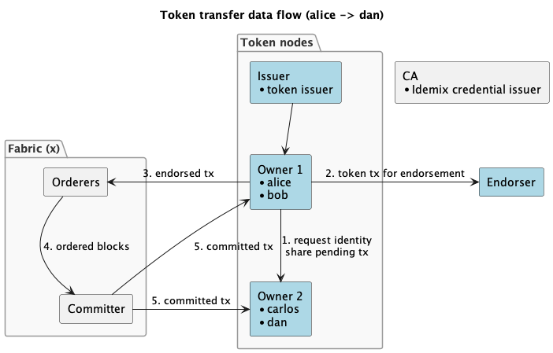
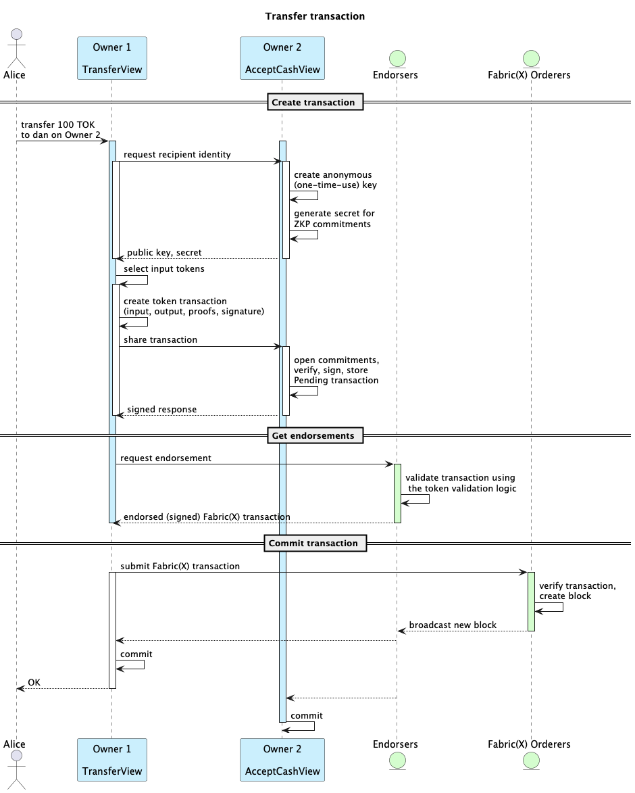

<!--
SPDX-License-Identifier: Apache-2.0
-->

# Token SDK Sample

The **Token SDK Sample** demonstrates how to:

- Build a simple token-based application using the [Token SDK](https://github.com/LFDT-Panurus/panurus).
- Connect the application to [Fabric-X](https://github.com/hyperledger/fabric-x), classic [Fabric](https://github.com/hyperledger/fabric), and [drunix](https://github.com/npci/drunix) (a Fabric 2.x fork) networks.
- Issue, transfer, redeem and lock (HTLC) tokens via a REST API.

## Table of Contents

- [Token SDK Sample](#token-sdk-sample)
  - [Table of Contents](#table-of-contents)
  - [About the Sample](#about-the-sample)
    - [Components](#components)
      - [Application services](#application-services)
      - [Fabric(x) Blockchain Network](#fabricx-blockchain-network)
    - [Application](#application)
    - [UTXO Model](#utxo-model)
    - [Deep Dive: What Happens During a Transfer?](#deep-dive-what-happens-during-a-transfer)
  - [Running the sample](#running-the-sample)
  - [Prerequisites](#prerequisites)
  - [Default option: Fabric-X with Ansible](#default-option-fabric-x-with-ansible)
    - [Requirements](#requirements)
    - [Installation](#installation)
    - [Setup Fabric-X](#setup-fabric-x)
  - [Option 2: Fabric-X test container](#option-2-fabric-x-test-container)
  - [Option 3: Fabric v3](#option-3-fabric-v3)
  - [Option 4: drunix](#option-4-drunix)
    - [Requirements](#requirements-1)
    - [Installation](#installation-1)
    - [Setup drunix](#setup-drunix)
  - [Interacting with the Application](#interacting-with-the-application)
  - [Example: Issue tokens](#example-issue-tokens)
  - [Example: Transfer tokens](#example-transfer-tokens)
  - [Example: Redeem tokens](#example-redeem-tokens)
  - [Example: HTLC lock, claim and reclaim](#example-htlc-lock-claim-and-reclaim)
  - [Automated end-to-end tests](#automated-end-to-end-tests)
  - [Stopping and restarting](#stopping-and-restarting)
  - [Teardown and cleanup](#teardown-and-cleanup)
  - [Development](#development)
  - [Debug mode](#debug-mode)
    - [VSCode](#vscode)
    - [Running the binaries](#running-the-binaries)
  - [Troubleshooting](#troubleshooting)

## About the Sample

This demo provides a set of services exposing REST APIs that integrate with the [Token SDK](https://github.com/LFDT-Panurus/panurus)
to issue, transfer, and redeem tokens backed by a **Hyperledger Fabric(x)** network for validation and settlement.

Together, these services form a _Layer 2 network_ capable of transacting privately among participants.
The ledger data does not reveal balances, transaction amounts, or participant identities.
Tokens are represented as UTXOs owned by pseudonymous keys, with details hidden through **Zero-Knowledge Proofs (ZKPs)**.

The application follows the Fabric-X programming model, where business parties directly endorse transactions—rather than Fabric peers executing chaincode.
Note that the [Token SDK](https://github.com/LFDT-Panurus/panurus) builds on top of the [Fabric Smart Client (FSC)](https://github.com/hyperledger-labs/fabric-smart-client), a framework to build distributed applications for Fabric(x).

This sample helps you get familiar with Token SDK features and serves as a starting point for your own proof of concept.

### Components

#### Application services

- **Issuer service** - creates (issues) tokens.
- **Owner services** - host user wallets.
- **Endorser service** - validates and approves token transactions.

#### Fabric(x) Blockchain Network

- An offline Certificate Authority (CA).
- Configuration for a **Fabric-X** test network.
- Configuration for a **Fabric v3** test network.
- Configuration for a **drunix** test network.

Below is a high level overview of the components and how data flows in a token transfer transaction.
The sequence diagram later in this readme provides more details about the token transaction.
For a specification of the Fabric-X components and their interactions, refer to the main [README.md](../../README.md).



### Application

From now on, we’ll refer to the issuer, endorser, and owner services collectively as nodes (not to be confused with Fabric peer nodes).

Each node runs as a separate application with:

- A REST API
- The FSC node runtime
- The Token SDK

Nodes communicate via _websockets_ to construct token transactions.
Each node also acts as a Fabric user, submitting transactions to the settlement layer — any Fabric or Fabric-X network.

A namespace (`token_namespace`) is deployed, along with a committed transaction containing the identities of the issuer, endorsers, and CA, enabling transaction validation.

### UTXO Model

Note that the application uses the UTXO model (like bitcoin).

- The issuer creates a token of `1000 TOK` owned by `alice`.
- When `alice` transfers `100 TOK` to `dan`, her `1000 TOK` token becomes the **input**.
- Two **outputs** are created:
  1. `100 TOK` owned by `dan`
  2. `900 TOK` owned by `alice`

Every transfer consumes existing outputs and creates new ones, ensuring balance consistency.

The Token SDK exposes all transactions, including "change" (the remainder returned to the sender).

### Deep Dive: What Happens During a Transfer?

Let’s examine how a private token transfer works between `alice` (Owner 1) and `dan` (Owner 2):

1. **Create Transaction:**

   Alice requests an anonymous key from Dan, creates commitments that can be verified by anyone, but can _only_ be opened (read) by Dan.
   The commitments contain the value, sender and recipient of each of the in- and output tokens.

2. **Get Endorsements:**

   Alice submits the transaction to the endorser which validates the transaction using the token validation logic.
   In detail, it verifies that all the proofs are valid and all the necessary signatures are there.
   Note that the endorser cannot see the actual transfer details thanks to the zero knowledge proofs.

3. **Commit Transaction:**

   Alice submits the endorsed fabric(x) transaction to the ordering service.
   Once committed, all involved nodes (Owner 1, Owner 2) receive events and update the transaction status to `Confirmed.`
   The transaction is now final; Dan now officially owns the `100 TOK`.



## Running the sample

## Prerequisites

You will need docker or podman to run the fabric network and application.

With the following command, we will download the Fabric 3 binaries, docker images and samples. For fabric-x based networks, we only use the Fabric CA for issuing idemix credentials for the accounts. If you want to run the same application against Fabric 3, this will provide you with the necessary prerequisites for that too.

```shell
make install-prerequisites
```

Make sure the CA binaries are accessible in your $PATH (add it to your .bashrc or .zshrc or equivalent for ease of use):

```shell
export PATH="$PATH:$(pwd)/fabric-samples/bin"
```

## Default option: Fabric-X with Ansible

Use ansible scripts to deploy real distributed networks. For the sake of this sample, we included a simple network that runs on your laptop, but there is a wealth of options to deploy to separate VMs with ease. Checkout the [Fabric-x Ansible Collection](https://github.com/LF-Decentralized-Trust-labs/fabric-x-ansible-collection?tab=readme-ov-file#option-2-install-from-source) to learn more.

### Requirements

- `python`;
- [`ansible`](https://docs.ansible.com/ansible/latest/installation_guide/intro_installation.html) >= **2.16**;

### Installation

```shell
make install-prerequisites
```

### Setup Fabric-X

Let the scripts know you want to use ansible (not strictly necessary as this is the default).
Then generate the crypto material.

```shell
export PLATFORM=fabricx
make setup
```

This creates:

- Fabric
  - config files and identities for the orderers and committers
  - a genesis block
  - users that can submit or query transactions
  - endorser identity
- Fabric Smart Client
  - identities for the nodes (issuer, owner1, owner2, endorser)
- Fabric Token SDK
  - an idemix issuer for the token accounts
  - idemix credentials signed by this issuer
  - cryptographic parameters and configuration for the token network (see: `go tool tokengen pp print -i conf/namespace/zkatdlognoghv1_pp.json`).

The relevant crypto material is copied to the folders in the conf/\* directories.

Then start the application and initialize it. The "init" endpoint records the cryptographic
parameters and configuration which we generated in the "setup" step on the blockchain. This will be the anchor for the token transactions.

```shell
make start
curl -X POST http://localhost:9300/endorser/init
```

Right after `make start` the Fabric-X network can still be converging, so the first `init` call may return
HTTP 500; retry it until it returns `{"message":"ok"}`. `init` deploys the public parameters from
`conf/namespace/zkatdlognoghv1_pp.json` (the endorser's `publicParameters.path`) to the ledger. Issuing
before a successful `init` fails with `issuer wallet not found`. Calling `init` again is safe: if the
ledger already holds these parameters it returns `ok` without submitting anything.

## Option 2: Fabric-X test container

The quickest way for development: a test version of Fabric-X in a single docker container!
First make sure that the crypto from the ansible network is cleared.

```shell
make teardown
make clean
```

Let the scripts know you want to use the test container ('xdev') and generate the necessary crypto material:

```shell
export PLATFORM=xdev
make setup
```

Start the application and initialize it. 

```shell
make start
curl -X POST http://localhost:9300/endorser/init
```

## Option 3: Fabric v3

It's also possible to the same application against a classic Fabric network. Clean up any previous
state and setup the classic Fabric material:

```shell
make teardown
make clean
export PLATFORM=fabric3
make setup
```

Start the Fabric network, create the namespace (chaincode), and start the application services. For Fabric 3, you don't have to call the Init endpoint; this is taken care of when installing the chaincode.

```shell
make start
```

## Option 4: drunix

[drunix](https://github.com/npci/drunix) is a fork of Fabric 2.x. Its peer/orderer/discovery/delivery gRPC
services, MSP/TLS conventions, and channel capabilities are all wire-compatible with this sample's "generic"
FSC driver, so the same application runs against it with no code changes — only a different backing network.

Unlike the other options, drunix isn't vendored into this sample: you need your own checkout of the
[drunix](https://github.com/npci/drunix) repo (which includes its own `drunix-network` test-network tooling)
and you build its binaries/images yourself, since they aren't published to a registry.

### Requirements

- Everything required for [Option 3](#option-3-fabric-v3) (Go, Docker).
- A checkout of `drunix` as a sibling of this `fabric-x-samples` checkout, i.e. at
  `<fabric-x-samples-parent>/drunix`, with `drunix-network` nested inside it at `drunix/drunix-network`
  (`git clone` drunix, then clone/copy `drunix-network` into it). Both `drunix.mk`'s `DRUNIX_REPO` and
  `DRUNIX_NETWORK` defaults assume this layout, relative to this sample's own location; override either
  with an environment variable if you keep drunix elsewhere:

  ```shell
  export DRUNIX_REPO=/path/to/drunix          # defaults to ../../drunix relative to this sample
  export DRUNIX_NETWORK=/path/to/drunix-network  # defaults to $DRUNIX_REPO/drunix-network
  ```

### Installation

Build drunix's own CLI binaries and Docker images (this also builds the `ccaas_builder` used for
chaincode-as-a-service):

```shell
export PLATFORM=drunix
make install-prerequisites
```

### Setup drunix

Clean up any previous platform's state, then generate drunix's crypto material:

```shell
make teardown
make clean
export PLATFORM=drunix
make setup
```

Start the network, deploy the namespace chaincode (as chaincode-as-a-service, same as Fabric v3 — no need
to call the Init endpoint), and start the application services:

```shell
make start
```

The backing database (YugabyteDB) can take a couple of minutes to become ready on first boot; `make start`
waits for it automatically before starting the peers. `start`, `stop` and `/endorser/init` behave as on
Fabric v3 (see [Stopping and restarting](#stopping-and-restarting)).

## Interacting with the Application

All services run as Docker containers and expose REST APIs.
They also communicate over P2P websockets as shown below:

| Rest API | P2P  | Service                     |
| -------- | ---- | --------------------------- |
| 8080     |      | API documentation (web)     |
| 9100     | 9101 | Issuer                      |
| 9300     | 9301 | Endorser 1                  |
| 9400     | 9401 | Endorser 2 (Fabric v3 and drunix only) |
| 9500     | 9501 | Owner 1 (alice and bob)     |
| 9600     | 9601 | Owner 2 (carlos and dan)    |

We can use the Swagger API on [http://localhost:8080](http://localhost:8080) or call the API directly via `curl`.

Now let's issue and transfer some tokens!

## Example: Issue tokens

We begin with initializing the token namespace (commit the parameters for the network) and issue `TOK` tokens to `alice`.

```bash
curl -X POST http://localhost:9300/endorser/init  # Fabric-X and xdev only; not needed for Fabric v3 or drunix

curl http://localhost:9100/issuer/issue -d '{
    "amount": {"code": "TOK","value": 1000},
    "counterparty": {"node": "owner1","account": "alice"},
    "message": "hello world!"
}'

curl http://localhost:9500/owner/accounts/alice | jq
curl http://localhost:9600/owner/accounts/dan | jq
```

## Example: Transfer tokens

Now `alice` transfers `100 TOK` to `dan`.

```bash
curl http://localhost:9500/owner/accounts/alice/transfer -d '{
    "amount": {"code": "TOK","value": 100},
    "counterparty": {"node": "owner2","account": "dan"},
    "message": "hello dan!"
}'

curl -X GET http://localhost:9600/owner/accounts/dan/transactions | jq
curl -X GET http://localhost:9500/owner/accounts/alice/transactions | jq
```

## Example: Redeem tokens

`alice` redeems (burns) `50 TOK`:

```bash
curl http://localhost:9500/owner/accounts/alice/redeem -d '{
    "amount": {"code": "TOK","value": 50},
    "message": "redeem test"
}'

curl http://localhost:9500/owner/accounts/alice | jq
```

## Example: HTLC lock, claim and reclaim

A hash time-locked contract (HTLC) lets `alice` lock tokens so that `dan` can only take them by revealing a secret
(the _pre-image_) before a deadline. If `dan` does not claim in time, `alice` can reclaim the tokens after the deadline.
It is the building block for atomic swaps between parties that do not trust each other.

Hashes and pre-images are exchanged as standard base64 strings. `deadline` is the number of seconds from now.
On a node with more than one token management service you can select one with an optional
`"tmsId": {"network": "default", "channel": "mychannel", "namespace": "token_namespace"}` (the channel is `arma` on Fabric-X and `mychannel` on Fabric v3 and drunix).

`alice` locks `20 TOK` for `dan` for one hour. The node generates the pre-image and returns it with its SHA-256 hash;
`alice` passes the pre-image to `dan` out of band. `dan` then claims the tokens:

```bash
LOCK=$(curl -s http://localhost:9500/owner/accounts/alice/lock -d '{
    "amount": {"code": "TOK","value": 20},
    "counterparty": {"node": "owner2","account": "dan"},
    "deadline": 3600
}')
echo "$LOCK" | jq
PREIMAGE=$(echo "$LOCK" | jq -r .payload.preimage)

curl http://localhost:9600/owner/accounts/dan/claim -d '{"preimage": "'"$PREIMAGE"'"}'
curl http://localhost:9600/owner/accounts/dan | jq
```

If nobody claims, `alice` can reclaim after the deadline, identifying the lock by its hash:

```bash
LOCK=$(curl -s http://localhost:9500/owner/accounts/alice/lock -d '{
    "amount": {"code": "TOK","value": 20},
    "counterparty": {"node": "owner2","account": "dan"},
    "deadline": 30
}')
HASH=$(echo "$LOCK" | jq -r .payload.hash)
sleep 35
curl http://localhost:9500/owner/accounts/alice/reclaim -d '{"hash": "'"$HASH"'"}'
```

If you already hold a secret, pass its SHA-256 digest as `hash` in the lock request. The response then contains no pre-image:

```bash
SECRET=$(openssl rand -base64 24)   # the pre-image
HASH=$(printf '%s' "$SECRET" | openssl base64 -d -A | openssl dgst -sha256 -binary | openssl base64 -A)
```

## Automated end-to-end tests

`make test` sets up and starts the network for `PLATFORM`, runs `init` where needed, then issues, checks
balances, transfers, lists transactions, redeems, and (optionally) runs the HTLC lock/claim/reclaim flow,
asserting the resulting balances. It tears the network down at the end, so start from a clean state:

```shell
make teardown && make clean

PLATFORM=fabricx HTLC_TEST=1 make test   # HTLC_TEST=1 also runs the HTLC tests on Fabric-X
PLATFORM=fabric3 make test               # HTLC tests run by default on Fabric v3
PLATFORM=drunix HTLC_TEST=1 make test    # drunix (channel mychannel, no init needed)
```

When switching between platforms, run `make teardown-all` first so no other platform's containers are
still attached to the shared `fabric_test` network.

## Stopping and restarting

- `make start` waits until every application node is ready (and, on Fabric v3, until the token service
  can load its public parameters), so you can send requests as soon as it returns.
- `make restart-app` rebuilds and restarts only the application; the ledger and balances are kept.
- `make stop` on **Fabric-X** stops all containers and keeps their data; `make start` resumes the same
  ledger and balances.
- `make stop` on **Fabric v3** tears the network down (the test network has no pause), so the next
  `make start` creates a fresh channel and balances start from zero.
- `make start` on an already running Fabric v3 network is refused with
  `existing fabric_test network detected`; the running network is not touched. On Fabric-X it is a no-op.
- `make start` before `make setup` fails with `... zkatdlognoghv1_pp.json not found. Run 'make setup' first.`

## Teardown and cleanup

To fully stop and delete the state of the application, run:

```shell
make teardown
```

To also delete the crypto (you'll have to run `make setup` again):

```shell
make clean
```

`make teardown`/`make clean` only act on the **current** `PLATFORM`. If you've switched between
options (fabricx/xdev/fabric3/drunix) in the same checkout, a previous platform's network can be
left running — use:

```shell
make teardown-all
```

to tear down every platform's stack regardless of which one is currently up (loops `make teardown`
once per platform, tolerating a platform that's already down).

Convenient Make targets are provided for shutting down, restarting, and cleaning the environment.

Run:

```shell
make help
```

for a list of available commands.

## Development

## Debug mode

For faster development, you can run the services outside Docker.

First, add the following to `/etc/hosts`:

```text
127.0.0.1 peer0.org1.example.com
127.0.0.1 peer0.org2.example.com
127.0.0.1 orderer.example.com
127.0.0.1 issuer.example.com
127.0.0.1 endorser1.example.com
127.0.0.1 endorser2.example.com
127.0.0.1 owner1.example.com
127.0.0.1 owner2.example.com
127.0.0.1 committer-sidecar
127.0.0.1 committer-queryservice
127.0.0.1 host.docker.internal
```

For drunix, also add its committing peers (used for delivery/discovery/finality — see
[Option 4](#option-4-drunix)):

```text
127.0.0.1 peer1.org1.example.com
127.0.0.1 peer1.org2.example.com
```

The application services discover the peer addresses from the channel configuration after connecting to committer-queryservice (or a trusted peer in Fabric v3/drunix).

Next, start the network as before, but instead of `make start`, do:

```bash
make start-fabric
# don't make start-app
```

### VSCode

If you use VSCode, copy:

```bash
mkdir -p ../../.vscode
cp launch.example.json ../../.vscode/launch.json
```

Then run or debug the application services directly.

### Running the binaries

In separate terminals:

```bash
cd conf/issuer && go run ../../issuer --port 9100
cd conf/endorser1 && go run ../../endorser --port 9300
cd conf/owner && go run ../../owner --port 9500
```

## Troubleshooting

If the application doesn't work, there's a good chance that it has to do with stale keys or data. Your best bet is to:

```shell
make teardown
make clean
make setup
```

Before running `make start` again.

Otherwise, take a look at the logs. Note that an error down the line could be caused by an issue at startup, often a misconfiguration.

**Fabric-X: `issuer wallet not found` on `/issuer/issue`.** This message hides a public-parameters
lookup failure (`docker logs tokens-issuer-1` shows `cannot retrieve public params for
[default,arma,token_namespace]`). Make sure `POST /endorser/init` returned `{"message":"ok"}` after the
latest `make start`. To confirm the parameters are on the ledger:
`docker exec committer-db psql -p 5435 -U sc_user -d sc_db -c "select key, octet_length(value) from ns_token_namespace;"`
— the `\x00736500` (setup) key must have a non-empty value.

**Fabric-X: `MSP Org1MSP is not defined on channel`.** The genesis block doesn't contain `Org1MSP`. The
collection's configtx template appends `MSP` to `organization.name`, so the inventory must use
`name: Org1` (not `Org1MSP`). Check with
`strings out/local-deployment/committer-sidecar/config/config-block.pb.bin | grep Org1` (expect `Org1MSP`,
not `Org1MSPMSP`), then `make teardown clean setup start`.

**Fabric-X: `invalid endorsement, expected one signed by [...]`.** `endorser1` (listed under
`fsc_endorsement.endorsers`) must resolve to the identity the endorser signs with. Each `conf/*/core.yaml`
maps it under `fabric.default.endpoint.resolvers` to `./keys/fabric/endorser`, which `make setup` copies
to every node; re-run `make clean setup` if that folder is missing.

**`docker compose build` fails with `open .../out/local-deployment/committer-db/data/pgdata: permission denied`.**
The build context must exclude `out/` (see `.dockerignore`).

**Fabric-X: `rm: cannot remove './out/local-deployment/committer-db/data': Permission denied`.** Left over
by a teardown that ran while Fabric-X wasn't deployed (Docker recreated the bind-mounted directory as
root). `make clean` now removes such leftovers through a short-lived container, and `make teardown` skips
the playbook when nothing is deployed.

**"issuer wallet not found" / other identity errors after switching platforms.** `make teardown`
only tears down the *current* `PLATFORM`'s network — if a previous platform's stack is still
running alongside the new one, or `conf*/data` still has a local FSC node database from an earlier
run, identities can go out of sync with freshly-generated crypto. Run `make teardown-all` (tears
down every platform regardless of which is currently up), then `make clean && make setup` for the
platform you actually want, before `make start`.

**drunix: "connection refused" / timeouts between containers.** If containers can reach each other by
container name but not via a `host-gateway`-style route to a published port (symptoms: `dial tcp ...
connect: connection refused` from one container trying to reach another through the host), check whether
a host firewall (e.g. `ufw`) is blocking forwarded traffic between Docker's bridge networks. A quick test:
`docker run --rm --network fabric_test alpine sh -c 'nc -zv <container-name> <port>'` from a disposable
container — if that succeeds but reaching the same port via the host's gateway IP doesn't, it's the
firewall. Fix: `sudo sed -i 's/^DEFAULT_FORWARD_POLICY=.*/DEFAULT_FORWARD_POLICY="ACCEPT"/' /etc/default/ufw && sudo ufw reload`.

**drunix: `make setup`/`make start` can't find `DRUNIX_REPO`/`DRUNIX_NETWORK`.** See
[Option 4's Requirements](#requirements-1) — either place your `drunix`/`drunix-network` checkout as a
sibling of this sample, or export `DRUNIX_REPO`/`DRUNIX_NETWORK` to point at wherever you keep them.
