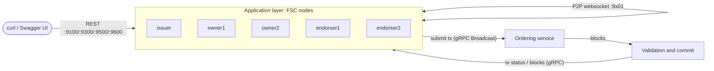
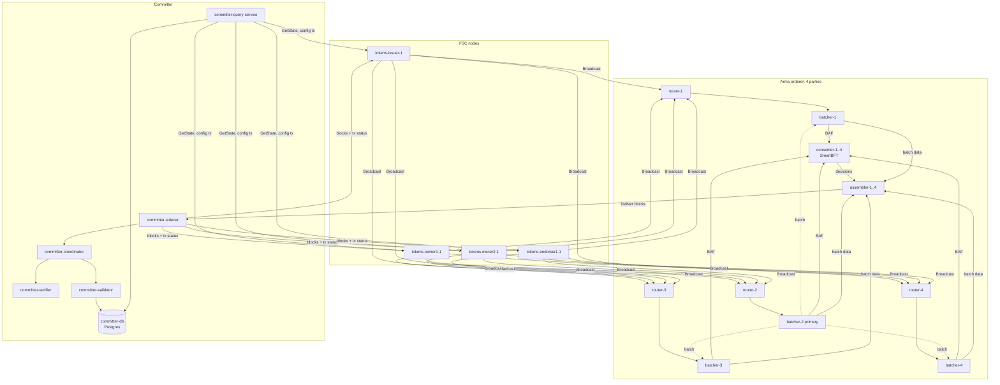
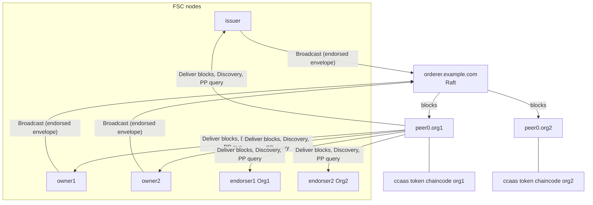
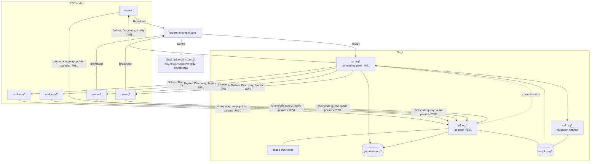
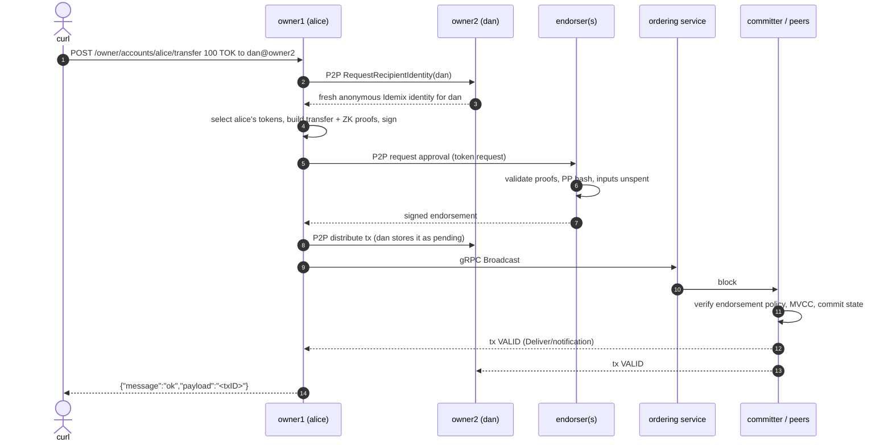

# Token sample: containers, network topology and what each command does

This explains every container you see (for example in `lazydocker`) when the token sample runs on
**Fabric-X**, **Fabric v3** and **drunix**, which component each one belongs to, how they connect, and
what travels between them for every `make` command and REST call. Container names, images, ports and
log lines are from live runs of this repo (`fabric-x-samples/tokens`).

- [1. The big picture](#1-the-big-picture)
- [2. Application layer (same on every network)](#2-application-layer-same-on-every-network)
- [3. Fabric-X](#3-fabric-x)
- [4. Fabric v3](#4-fabric-v3)
- [5. drunix](#5-drunix)
- [6. What each command does](#6-what-each-command-does)
- [7. What each REST call does](#7-what-each-rest-call-does)
- [8. Where data is stored](#8-where-data-is-stored)
- [9. Running commands more than once](#9-running-commands-more-than-once)
- [10. Glossary](#10-glossary)

---

## 1. The big picture

Every setup has two halves on one Docker network called **`fabric_test`**:

1. **Application layer**: five Fabric Smart Client (FSC) nodes built from this repo (`issuer`,
   `owner1`, `owner2`, `endorser1`, `endorser2`) plus a Swagger UI. They hold wallets, build token
   transactions, talk to each other peer-to-peer and expose the REST API you call with `curl`.
2. **Ledger layer**: the blockchain that orders and commits those transactions. This part differs per
   platform (Fabric-X committer + Arma orderer, classic Fabric peers + orderer, or drunix's split peers).

Protocols used:

| From → to | Protocol | Purpose |
| --- | --- | --- |
| you → FSC node | HTTP REST (`:9000` inside container, published as 9100/9300/9400/9500/9600) | issue, transfer, balances, ... |
| FSC node ↔ FSC node | websocket P2P (`:9101`, `:9301`, `:9401`, `:9501`, `:9601`), mutually authenticated with each node's TLS cert | exchange identities, collect signatures and endorsements, distribute transactions |
| FSC node → ledger | gRPC | broadcast transactions, receive blocks/status, query state |

The token logic itself (UTXO tokens, zero-knowledge `zkatdlog` driver, wallets) is the Panurus Token SDK
running *inside* the FSC nodes. The ledger never sees amounts in clear; it stores commitments and checks
that an authorised endorser signed the transaction.

---

## 2. Application layer (same on every network)

Started by `make start-app` (part of `make start`) from `tokens/compose.yml`
(+ `compose-endorser2.yml` on Fabric v3 and drunix). Images are built from this repo's `Dockerfile`
(`go build -tags <platform>`), so the same code talks to whichever ledger `PLATFORM` selects.

| Container | Image | REST | P2P | Role |
| --- | --- | --- | --- | --- |
| `tokens-issuer-1` | `tokens-issuer` | 9100 | 9101 | Holds the issuer wallet `iss`. Creates new tokens. Also co-signs redeems. |
| `tokens-owner1-1` | `tokens-owner1` | 9500 | 9501 | Wallets for **alice** and **bob** (Idemix, anonymous). Transfers, redeems, HTLC. |
| `tokens-owner2-1` | `tokens-owner2` | 9600 | 9601 | Wallets for **carlos** and **dan**. |
| `tokens-endorser1-1` | `tokens-endorser1` | 9300 | 9301 | Token endorser: validates every token request and signs it with the Fabric `endorser` identity. On Fabric-X it also runs `/endorser/init`. |
| `tokens-endorser2-1` | `tokens-endorser2` | 9400 | 9401 | Second endorser (Org2), only on Fabric v3 and drunix. |
| `tokens-swagger-ui-1` | `swaggerapi/swagger-ui` | 8080 | – | Web UI for `swagger.yaml`. Not part of the network. |

Each FSC node mounts its folder from `conf/` (Fabric-X), `conf-f3/` (Fabric v3) or `conf-drunix/`
(drunix) at `/conf`:

- `core.yaml`: node config (P2P peers, ledger endpoints, token management service).
- `keys/node.{crt,key}`: P2P/TLS identity. `keys/nodes/*.crt`: the other nodes' P2P certs.
- `keys/fabric/*`: Fabric MSP identities used to sign ledger transactions (`user`, `endorser`).
- `keys/wallet/*`: token wallets (issuer key, Idemix credentials for alice/bob/carlos/dan).
- `data/`: the node's local SQLite databases (token vault, wallets, transaction history).

Two identities per node, used for different things:

- **P2P identity** (`keys/node.crt`): proves "I am node owner1" on the websocket links.
- **Fabric identity** (`keys/fabric/...`, MSP `Org1MSP`/`Org2MSP`): signs ledger transactions. The
  ledger checks this one.

---

## 3. Fabric-X

### 3.1 Why "ubi9"

All Fabric-X orderer and committer containers run `hyperledger/fabric-x-orderer:1.0.4` and
`hyperledger/fabric-x-committer:1.0.4`. Both images are built on Red Hat **UBI 9 minimal**
(`com.redhat.component=ubi9-minimal-container`, `name=ubi9/ubi-minimal`). lazydocker shows that
base-image label, which is why many containers appear as "ubi9". The containers are named after their
role (`orderer-router-1`, `committer-sidecar`, ...).

They are not created by `docker compose`: the Ansible playbooks (`make start` → `ansible/playbooks/60-start.yaml`)
create them one by one with `docker run`. Configs and data are bind-mounted from
`tokens/out/local-deployment/<container>/{config,data}`.

### 3.2 Containers (27 in total)

**Arma ordering service**: 4 *parties* (think "4 independent organisations"), each running the same 4
components. That makes 16 containers, and the service tolerates one faulty party (BFT, N=4, quorum 3).

| Containers | Command | Ports (party 1/2/3/4) | Role |
| --- | --- | --- | --- |
| `orderer-router-{1..4}` | `arma router` | 7050 / 7150 / 7250 / 7350 | Entry point. Receives transactions from clients (gRPC Broadcast), checks size and signature, forwards them to its party's batcher. Clients send every transaction to **all 4** routers. |
| `orderer-batcher-{1..4}` | `arma batcher` | 7051 / 7151 / 7251 / 7351 | Groups transactions into *batches*. One batcher is the shard's **primary** (party 2 in our runs) and cuts the batch. The other three pull it and persist it. All four then send a signed **batch attestation fragment (BAF)** to the consenters. |
| `orderer-consenter-{1..4}` | `arma consensus` | 7052 / 7152 / 7252 / 7352 | Run SmartBFT consensus over batch attestations, not over the transactions themselves. They decide the global order of batches. |
| `orderer-assembler-{1..4}` | `arma assembler` | 7053 / 7153 / 7253 / 7353 | Combine the consenters' decisions with the batch data pulled from their batcher into standard blocks. They append the blocks to the orderer ledger and serve them over gRPC Deliver. |

Each orderer also exposes an operations/health port at gRPC port + 10 (7060, 7061, ...).

**Committer**: validates and commits ordered blocks. In Fabric-X this replaces the classic peer.

| Container | Image | Port | Role |
| --- | --- | --- | --- |
| `committer-sidecar` | fabric-x-committer `start sidecar` | 4001 | Pulls blocks from the assemblers (data from party 1, headers/signatures from all parties, BFT-safe). Stores them in its own block store (`/data/ledger`) and hands transactions to the coordinator. Serves **Deliver** and the **notification service** (tx status) to FSC nodes. |
| `committer-coordinator` | `start coordinator` | 5300 | Builds a dependency graph of transactions in a block so independent ones are validated in parallel. Sends them to the verifier, then to the validator-committer, and returns per-tx status to the sidecar. |
| `committer-verifier` | `start verifier` | 5200 | Checks signatures against each namespace's **endorsement policy**. For `token_namespace` the policy is a threshold signature by the `endorser` user key, set when the namespace was created. |
| `committer-validator` | `start validator-committer` | 5100 | MVCC check (read versions still current?), then writes the new state and the tx status into Postgres. |
| `committer-query-service` | `start query-service` | 7001 | Read API over the committed state (`GetState`, latest config transaction). FSC nodes use it to fetch public parameters and the channel config. |
| `committer-db` | `postgres:17.10` (port 5435) | 5435 | World state. One table per namespace (`ns_token_namespace`), plus `ns__meta` (namespace policies), `ns__config`, `tx_status`, `metadata` (last committed block). |

Each committer service also has a metrics port (2120–2160).

**Not a container**: `orderer-loadgen` in the Ansible inventory is only used at `make setup`/`make start`.
It generates the client crypto, and the `fxconfig` tool creates the `token_namespace` namespace with its
endorsement policy. It does not keep running.

### 3.3 Topology

### 3.4 One issue transaction, as captured (timestamps from container logs)

`POST /issuer/issue` 1000 TOK to alice. The whole flow took about 1.6 s:

| Time | Container | Log / action |
| --- | --- | --- |
| .536 | issuer | `going to issue 1000 TOK to [alice] on [owner1]` |
| .647 | owner1 | P2P connection from issuer: returns a fresh anonymous Idemix identity for alice |
| .783 | issuer | builds the token request: `collecting signatures and submitting transaction` |
| .785 | endorser1 | P2P connection from issuer: validates the request (zk proofs, issuer is authorised), signs with the `endorser` key |
| .907 | issuer | `submitting fabric transaction to orderer`: opens gRPC to `orderer-router-1..4` |
| .909 | router-1..4 | `Broadcast -> Client connected` |
| 2.068 | batcher-2 | `Batcher batched a total of 1 requests for sequence 2` (primary) |
| 2.081–2.103 | batcher-1/3/4 | `Fetched batch 2 with 1 transactions`, `Sending batch attestation fragment` |
| 2.477 | consenter-1 | `Proposing available common data block: number=3` |
| 2.492–2.499 | consenter-1..4 | prepares → commits from 2 others → `Deciding on seq 3` |
| 2.520–2.541 | assembler-1..4 | `Decision 3`, `Appended block 3 of 1 requests to ledger` |
| ~2.6–3.0 | sidecar → coordinator → verifier → validator → Postgres | block 3 validated (endorser signature matches the namespace policy, MVCC ok), state written, status `COMMITTED` |
| 3.104 | issuer | finality notification from the sidecar: `issued 1000 TOK ... ID: [356bd2c3...]` |

Meanwhile owner1 also received the transaction over P2P, stored it as pending, and marked alice's new
token as spendable when the same finality event arrived.

---

## 4. Fabric v3

A classic Hyperledger Fabric v3 network from `fabric-samples/test-network` (downloaded by
`make install-prerequisites`). It is started by `network.sh up createChannel` and
`network.sh deployCCAAS` (`fabric3.mk`), and uses channel `mychannel` with two organisations.

### 4.1 Containers (11 in total)

| Container | Image | Ports | Role |
| --- | --- | --- | --- |
| `orderer.example.com` | `hyperledger/fabric-orderer` | 7050 (Broadcast/Deliver), 7053 (admin), 9443 (ops) | Single ordering node (`OrdererMSP`) using Raft (etcdraft). Receives endorsed transactions, cuts blocks, serves them to peers. |
| `peer0.org1.example.com` | `hyperledger/fabric-peer` | 7051, 9444 | Org1 peer: pulls blocks from the orderer, validates them (endorsement policy check via VSCC, MVCC), commits to its ledger (LevelDB state + block files). Serves Deliver, Discovery and chaincode queries to the FSC nodes. |
| `peer0.org2.example.com` | `hyperledger/fabric-peer` | 9051, 9445 | Same for Org2. |
| `peer0org1_token_namespace_ccaas` | `token_namespace_ccaas_image` | – | The **token chaincode** (Panurus `tcc`, built from `conf-f3/namespace/Dockerfile` with the public parameters baked in), run as chaincode-as-a-service and connected to peer0.org1. |
| `peer0org2_token_namespace_ccaas` | same | – | Same chaincode for peer0.org2. |
| app layer | see section 2 | | issuer, owner1, owner2, endorser1 (**Org1MSP**), endorser2 (**Org2MSP**), swagger-ui |

What the chaincode does here: the token logic runs in the FSC endorsers, not in the chaincode. The
chaincode (namespace `token_namespace`) does three things:

- Defines the namespace and its endorsement policy (majority of Org1 and Org2, so both endorsers sign).
- Stores the public parameters through its `init` function, called once by `deployCCAAS -cci init`.
- Answers public-parameter queries from the FSC nodes.

That's why `/endorser/init` isn't needed (it is a no-op on Fabric v3).

### 4.2 Topology

### 4.3 Transaction path

FSC builds the token request, then endorser1 **and** endorser2 each validate it and sign a Fabric proposal
response with their MSP identity. The initiator wraps everything into a Fabric envelope and sends it to
`orderer.example.com`. The orderer puts it in a block. Both peers pull the block, VSCC checks that the
endorsements satisfy the `token_namespace` policy (Org1 + Org2), MVCC checks the read versions, and the
state is committed. The FSC nodes follow `peer0.org1` over Deliver, see the transaction as `VALID` and
update their local vaults.

Captured transfer (alice → dan, 100 TOK):

| Time | Container | Log |
| --- | --- | --- |
| 36.204 | owner1 | `going to issue 100 TOK to [dan] on [owner2]`, `requesting [dan] identity from [owner2]` |
| 36.206 | owner2 | P2P connection from owner1 (returns dan's identity) |
| 36.255 | owner1 | `collecting signatures` |
| 36.257 / 36.259 | endorser1 / endorser2 | P2P connections from owner1: both validate and sign |
| 36.284 | owner1 | `submitting fabric transaction to orderer` |
| 38.288 | orderer | `Created block [8]` (it waited up to the 2 s batch timeout for more transactions) |
| 38.311 | peer0.org1, peer0.org2 | `Received block [8]`, `Validated block [8]`, `Committed block [8] with 1 transaction(s)` |
| 38.371 | owner1 | `transferred 100 TOK from [alice] to [dan]` (finality seen via Deliver) |

---

## 5. drunix

drunix is NPCI's fork of Fabric 2.x (`drunix/`, network scripts in `drunix/drunix-network/test-network`,
started by `drunix.mk`). It keeps Fabric's protocols, so the same FSC "generic" driver works. Each
organisation's single peer is split into specialised containers, and the state DB is YugabyteDB
(PostgreSQL-compatible) instead of LevelDB/CouchDB. See `drunix/docs/drunix-arch.md`.

### 5.1 Containers (19 in total)

Per organisation (Org1 shown; Org2 is the same with `org2` names and ports 9051/9061/9071):

| Container (`docker ps` name) | Network alias | Image | Ports | Role |
| --- | --- | --- | --- | --- |
| `lp1.org1` | `peer0.org1.example.com` | `npcioss/drunix-peer` (`CORE_PEER_LITEPEER_ENABLED=true`) | 7051 | **Lite Peer**: endorsement only. Runs chaincode simulations and answers endorsement/query calls. It is stateless and keeps no local ledger past the genesis block. Commit-status requests are forwarded to the committing peer. |
| `cp.org1` | `peer1.org1.example.com` | `npcioss/drunix-peer` | 7061 | **Committing Peer**: pulls blocks from the orderer, batches transactions to the validation service, runs MVCC, commits to the block store and YugabyteDB. Serves Deliver/Discovery/finality to FSC. |
| `vs1.org1` | `peer2.org1.example.com` | `npcioss/drunix-vscc` | 7071 | **Validation Service**: stateless endorsement-policy checks (the old VSCC), with a worker pool (`CORE_PEER_VALIDATORPOOLSIZE=128`). Can be scaled out. |
| `yugabyte-org1` | – | `yugabytedb/yugabyte` | 5433 (org2 published as 5123) | World state DB shared by the org's peers (SQL, `jsonb` values; binary values are base64-wrapped by the drunix fix). |
| `hlf_keydb_org1msp` | – | `eqalpha/keydb` | 6479 (org2: 6389) | KeyDB (Redis-compatible) **transient store / shared cache** for the org's peers, used for private data so LP and CP don't have to exchange it over the network. |
| `peer0org1_token_namespace_ccaas` | – | `token_namespace_ccaas_image` | – | Token chaincode (`tcc`) as a service, connected to the lite peer. |

Shared:

| Container | Image | Ports | Role |
| --- | --- | --- | --- |
| `orderer.example.com` | `npcioss/drunix-orderer` | 7050, 7053, 9443 | Ordering node (Raft). |
| app layer | section 2 | | issuer, owner1, owner2, endorser1, endorser2, swagger-ui |

### 5.2 Topology

The FSC configs (`conf-drunix/*/core.yaml`) list the lite peer as the default peer and the committing peer
for `usage: delivery`, `discovery` and `finality`. The lite peer never advances past block 0, so FSC must
follow the committing peer to learn about new blocks.

### 5.3 Transaction path

Same as Fabric v3 (both FSC endorsers sign, orderer orders), except the validation and commit side:
`cp.orgN` receives the block and sends its transactions in batches to `vs1.orgN` for the endorsement-policy
check. It then runs MVCC against YugabyteDB, writes the new state to YugabyteDB, and appends the block. FSC
nodes see the result through the committing peer's Deliver stream.

Captured during a transfer (ledger side):

| Time (UTC) | Container | Log |
| --- | --- | --- |
| 03.293 | orderer.example.com | `etcdraft propose -> Created block [8]`. drunix's orderer also splits the block per org (`sparseblock ... returning Next blocknumber`). |
| 03.316 | cp.org1, cp.org2 | `Received block [8]` |
| 03.318 | vs1.org1, vs1.org2 | `VsccService/ProcessVscc` call completed: endorsement policy checked |
| 03.318 | cp.org1, cp.org2 | `Validated block [8] in 2ms` |
| 03.411 | cp.org1, cp.org2 | `[sqldb] Set` (state written to YugabyteDB) |
| 03.416 | cp.org1, cp.org2 | `Committed block [8] with 1 transaction(s) in 97ms` |

The lite peers log nothing here: they take no part in committing.

---

## 6. What each command does

All commands run from `fabric-x-samples/tokens` with `PLATFORM=fabricx|fabric3|drunix`
(Fabric-X is the default).

### `make install-prerequisites` (once)

| Platform | What happens |
| --- | --- |
| all | `install-fabric.sh --fabric-version 3.1.4` downloads Fabric binaries (`fabric-ca-server`, `configtxgen`, `peer`, ...) and `fabric-samples/`; `go mod tidy`. |
| fabricx | Creates `ansible/.venv`, installs Ansible and the `hyperledger.fabricx` collection (0.9.2), installs control-node prerequisites (Docker access etc.). |
| drunix | Builds the drunix images (`npcioss/drunix-peer`, `-orderer`, `-vscc`) from `drunix/`. |

### `make setup`: generate keys and configuration, no containers left running

Runs `clean` first, then the platform part, then the app part.

| Step | Fabric-X | Fabric v3 / drunix |
| --- | --- | --- |
| Ledger crypto and config | Ansible `20-setup.yaml`: `cryptogen` for 4 orderer orgs + `org1.example.com` (committer, users `channel_admin`, `endorser`, `User1`); Postgres TLS crypto; Arma shared config; **genesis block** for channel `arma` via `configtxgen` (orderer orgs + `Org1MSP` as application org); per-container configs written to `out/local-deployment/*/config`. Then `cp_fabricx.sh` copies the `User1` and `endorser` MSPs into `conf/*/keys/fabric`. | Nothing yet: the network crypto is created by `network.sh` during `make start`. |
| App images | `docker compose build`: builds `tokens-issuer`, `-owner1`, `-owner2`, `-endorser1` (`-endorser2`) from the `Dockerfile`, compiled with `-tags <platform>`. | same |
| App crypto (`scripts/gen_crypto.sh`) | Starts a temporary `fabric-ca-server` on the host (port 7054, Idemix curve BN254). Registers and enrolls Idemix credentials for alice, bob (owner1), carlos and dan (owner2). Enrolls TLS certs for each FSC node (`keys/node.crt`) and copies them to every node (`keys/nodes/`). Creates the issuer key pair (`issuer/keys/wallet/iss`). Runs `tokengen` to create the **public parameters** `<conf>/namespace/zkatdlognoghv1_pp.json` (Idemix issuer key + issuer cert + zkatdlog crypto parameters). Then stops the CA. | same, into `conf-f3/` or `conf-drunix/` |

### `make start`: bring everything up

**Fabric-X** (`60-start.yaml`, then the app):

1. Creates the Docker network `fabric_test` if missing.
2. Starts the 16 Arma orderer containers (party 1 to 4), each loading the genesis block.
3. Starts `committer-db` (Postgres) and the 5 committer services. The sidecar connects to the assemblers
   and the coordinator, and processes block 0 (genesis/config).
4. `fxconfig create_namespaces` submits a namespace transaction creating `token_namespace`, with the
   threshold policy "signed by the `endorser` user's key". It goes through the orderer and committer like
   any transaction and lands in `ns__meta` (block 1). This is why the verifier logs
   `New verification policies for namespaces [token_namespace]`.
5. `docker compose up -d` for the app, then `wait-app` waits for every node's `/readyz`.

The ledger now has the namespace but **no public parameters**. Call `POST /endorser/init` once (next section).

**Fabric v3 / drunix** (`network.sh`):

1. `network.sh up createChannel`: `cryptogen` creates `OrdererOrg`, `Org1`, `Org2` crypto; starts the orderer
   and peers (drunix also starts YugabyteDB, waits until it is ready, then KeyDB, lite/committing peers and
   validation services); creates `mychannel` via the orderer's channel-participation API; joins the
   peers; sets anchor peers.
2. `network.sh deployCCAAS -ccn token_namespace -cci init`: builds the chaincode image from
   `<conf>/namespace/Dockerfile` (Panurus `tcc` + public parameters), packages and installs it on the
   peers, approves it for Org1 and Org2, commits the definition, starts the two `*_ccaas` containers, and
   invokes `init`, which writes the public parameters to the ledger in a normal transaction.
3. `cp_fabric3.sh` copies the user/endorser MSPs and the peer TLS CA into `<conf>/*/keys/fabric`.
4. App containers start, then `wait-app` also waits until owner1 can load the token service (on a fresh
   network the chaincode answers a few seconds after the containers report ready).

### `POST /endorser/init`: Fabric-X only

The endorser reads `conf/namespace/zkatdlognoghv1_pp.json` and asks the query service whether the ledger
already holds exactly these parameters. If yes, it does nothing and returns `ok`. Otherwise it builds a
transaction that writes the parameters (setup key `\x00se\x00`) and their SHA-256 hash (setup-hash key)
into `token_namespace`. It signs the transaction with its `endorser` identity, broadcasts it to the 4
routers, and waits until it is committed. Every FSC node receives the commit and loads the token service
("update TMS ... with public params"). From then on, all token transactions declare a read dependency on
this setup key version. Calls are serialised; on Fabric v3/drunix the endpoint is a no-op.

### `make stop`

- **Fabric-X**: stops the app containers and the orderer/committer containers. Data stays (bind mounts in
  `out/local-deployment`), so `make start` resumes the same ledger and balances.
- **Fabric v3 / drunix**: there is no "pause" in `network.sh`, so `stop` is a full teardown of the ledger
  and app (fresh channel on the next `start`, balances reset).

### `make restart-app`

Rebuilds the app images, recreates the 5–6 app containers, and waits until they are ready. Ledger and
local databases (`<conf>/*/data`) are kept, so balances survive.

### `make teardown`

Removes the app containers and their local databases, then the ledger containers, their data and the
`fabric_test` network. On Fabric-X it is skipped if nothing is deployed.

### `make teardown-all`

Runs `teardown` for fabricx, xdev, fabric3 and drunix in turn and removes `fabric_test`. Use it before
switching platforms: all platforms share the app containers and the `fabric_test` network.

### `make clean`

Deletes generated keys, local databases and public parameters (`<conf>/*/keys`, `<conf>/*/data`,
`<conf>/namespace/*.json`), and on Fabric-X the whole `out/` directory.

### `make test`

`setup` + `start` + `init` (Fabric-X) + all REST calls below with balance assertions, then `teardown` +
`clean`. Add `HTLC_TEST=1` for the HTLC part on Fabric-X/drunix (always on for Fabric v3).

---

## 7. What each REST call does

Every write operation follows the same skeleton, built from Panurus "views" (small protocols that FSC
nodes run against each other over P2P):

1. **Assemble**: the initiating node selects input tokens from its local vault (and locks them so a
   parallel request can't pick the same ones), gets the recipient's identity, and builds a token request
   with zero-knowledge proofs.
2. **Collect signatures** (`CollectEndorsementsView`): token owners/issuers sign the request. The request
   is then sent to the **FSC endorser(s)**, which check the proofs, the public parameters and the
   double-spend state, then sign the ledger transaction with their Fabric `endorser` identity
   (Fabric-X: endorser1; Fabric v3/drunix: endorser1 + endorser2). The transaction is also distributed to
   every party involved, who store it as pending.
3. **Order and finality** (`OrderingAndFinalityView`): the initiator broadcasts the transaction to the
   ordering service, then waits for the committed status. All involved nodes see the same status and
   update their vaults (new tokens spendable, spent tokens removed).

The ledger part (steps "ORD" and "C") is:

- **Fabric-X**: routers → batcher primary → batchers attest → consenters SmartBFT → assemblers block →
  sidecar → coordinator → verifier (signature vs `token_namespace` policy) → validator-committer (MVCC,
  Postgres) → sidecar notification.
- **Fabric v3**: orderer (Raft) → peer0.org1 and peer0.org2 (VSCC: Org1 and Org2 endorsements present,
  MVCC, LevelDB) → Deliver.
- **drunix**: orderer → cp.orgN → vs1.orgN (policy) → cp.orgN (MVCC, YugabyteDB) → Deliver from cp.org1.

### Per call

| Call | Node | What happens |
| --- | --- | --- |
| `POST /issuer/issue` | issuer | Binds `alice` to node `owner1`, asks owner1 for a fresh identity for alice, creates new tokens signed with the issuer key `iss`, collects endorsement(s), orders, waits for finality. No inputs are spent. |
| `GET /owner/accounts/{id}` | owner | Reads unspent tokens of that wallet from the node's local vault (SQLite). **No ledger call.** |
| `POST .../transfer` | owner (sender) | Diagram above. If the recipient is on the same node, its identity is taken locally (no P2P call). Change goes back to the sender as a new token. |
| `GET .../transactions` | owner | Reads the node's local transaction DB (`ttxdb`). No ledger call. |
| `POST .../redeem` | owner | Builds a transaction that burns tokens. Redeeming needs the **issuer's** approval, so the owner contacts the `issuer` node over P2P to co-sign, then endorsement, ordering and finality. |
| `POST .../lock` (HTLC) | owner1 | Exchanges identities with owner2 in both directions. Creates an output owned by an **HTLC script** (sender alice, recipient dan, SHA-256 hash, deadline) and returns the pre-image (or uses the hash you sent). owner2 receives the transaction, accepts it and stores the lock. Endorse, order, finality. |
| `POST .../claim` | owner2 | Finds the lock in dan's HTLC wallet by the pre-image's hash, then spends the script output to dan by revealing the pre-image. A second claim of the same lock fails with `expected exactly one htlc script to match, got [0]`, because the lock is already spent. |
| `POST .../reclaim` | owner1 | After the deadline, spends the expired script output back to alice. Rejected before the deadline. |
| `GET /readyz` | any | Node's HTTP server is up (used by `wait-app`). |

---

## 8. Where data is stored

| What | Where | Platform |
| --- | --- | --- |
| FSC node state: token vault, wallets/identities, keystore, transaction records, endorser records | `<conf>/<node>/data/fts.sqlite` (bind-mounted at `/conf/data`) | all |
| Keys, wallets, public parameters | `<conf>/<node>/keys`, `<conf>/namespace/zkatdlognoghv1_pp.json` | all |
| Orderer write-ahead logs and ledgers | `out/local-deployment/orderer-*/data` | Fabric-X |
| Committer block store | `out/local-deployment/committer-sidecar/data/ledger` | Fabric-X |
| World state, tx status, namespace policies | Postgres `sc_db` in `committer-db` (`out/local-deployment/committer-db/data`). Inspect with `docker exec committer-db psql -p 5435 -U sc_user -d sc_db` | Fabric-X |
| Blocks and LevelDB state | Docker volumes `docker_peer0.org1.example.com`, `docker_peer0.org2.example.com`, `docker_orderer.example.com` | Fabric v3 |
| World state | YugabyteDB `yugabyte-orgN` (port 5433 / 5123) | drunix |
| Blocks | Docker volumes `compose_peer*`, `compose_orderer.example.com` | drunix |
| Private data / transient cache | KeyDB `hlf_keydb_orgNmsp` | drunix |

How a token looks on the ledger: never as "alice has 100". Outputs are Pedersen commitments to
(type, value, owner), owners are unlinkable Idemix pseudonyms, and spending reveals only a serial
number plus ZK proofs. Only the parties involved (and their FSC vaults) know amounts and owners.

---

## 9. Running commands more than once

Verified by running every case below on all three platforms (repeat/concurrency script plus the
official `make test`):

| Action | Fabric-X | Fabric v3 | drunix |
| --- | --- | --- | --- |
| `/endorser/init` 3× in a row, then 3× in parallel | first call deploys, rest return `ok` without a new transaction | no-op `ok` | no-op `ok` |
| 5 parallel `init` on a fresh network | exactly one deploy, 4 skip | no-op | no-op |
| 3 rounds of issue → transfer → redeem → lock → claim → short lock → reclaim | all succeed, balances exact | same | same |
| Same `claim` sent twice | second rejected (lock already spent) | same | same |
| 5 parallel issues / 5 parallel transfers | all 5 succeed (inputs are locked per request) | same | same |
| `make start` while running | no-op (Ansible and compose are idempotent) | refused: "existing fabric_test network detected. Run 'make teardown' first." Running network unaffected | same as Fabric v3 |
| `make restart-app` | balances kept, ops work | same | same |
| `make stop` then `make start` | resumes same ledger and balances | fresh network (stop = teardown) | same as Fabric v3 |
| `make teardown` / `clean` / `setup` twice each | all succeed | same | same |
| `make start` without `make setup` | fails fast: "…zkatdlognoghv1_pp.json not found. Run 'make setup' first." | same | same |

Bugs found and fixed while testing this are in [ALL-PLATFORMS-FIXES.md](ALL-PLATFORMS-FIXES.md)
(re-running init broke Fabric-X with MVCC conflicts; `stop`→`start` failed on Fabric v3/drunix;
first request after a fresh Fabric v3/drunix start failed; root-owned `out/` after teardown).

---

## 10. Glossary

| Term | Meaning |
| --- | --- |
| FSC | Fabric Smart Client: the framework the app nodes are built on (P2P views, vault, Fabric drivers). |
| Panurus / Token SDK | Token library inside the FSC nodes: wallets, token requests, validation, HTLC. |
| TMS | Token Management Service for one (network, channel, namespace), here `default/arma/token_namespace` or `default/mychannel/token_namespace`. |
| Public parameters (PP) | Crypto parameters + issuer/Idemix keys that every node and endorser must agree on; stored on the ledger. |
| zkatdlog | The privacy-preserving token driver (commitments + zero-knowledge proofs). |
| Idemix | Anonymous credential scheme. Owners prove "I'm a valid member" without revealing which one. |
| MSP | Membership Service Provider: an organisation's identity definition (`Org1MSP`, ...). |
| Namespace | Fabric-X's unit of state and policy, like a chaincode. Here `token_namespace`. |
| Endorsement | Signature(s) that make a transaction acceptable to the ledger's policy. |
| MVCC | Multi-version concurrency control: a transaction is rejected if a key it read changed since. |
| Arma | Fabric-X's sharded BFT ordering service (router, batcher, consenter, assembler). |
| BAF | Batch attestation fragment: a batcher's signed statement that it holds a batch. |
| SmartBFT | Byzantine fault tolerant consensus used by the consenters (N=4, tolerates 1 faulty). |
| CCaaS | Chaincode as a service: chaincode runs in its own container and the peer connects to it. |
| Lite / Committing Peer, VS | drunix's split of a Fabric peer: endorsement, commit, policy validation. |
| UBI9 | Red Hat Universal Base Image 9: base image of the Fabric-X containers ("ubi9" in lazydocker). |
